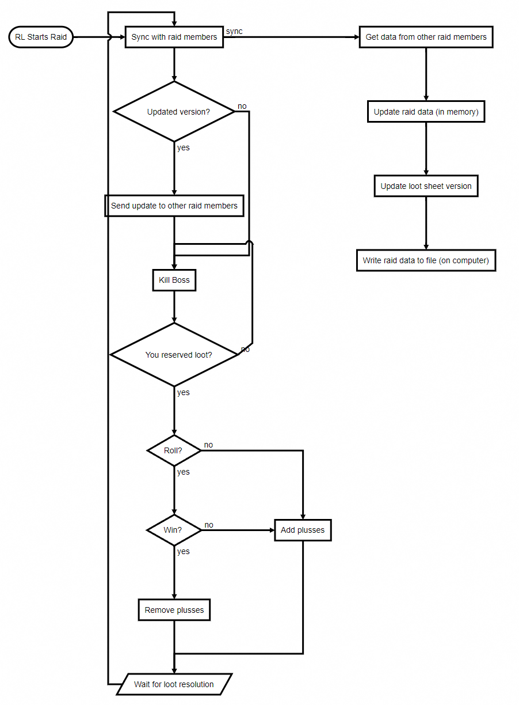

# Design Document

This document will show what changes we plan on making to help me keep track of what needs to be done. It should show current layout along with expected future layout.

- [Windows](#windows)
  - [Main Window](#main-window)
  - [Main Window Options](#main-window-options)
  - [Host Window](#host-window)
  - [Host Window Options](#host-window-options)
- [Backend](#backend)
  - [Tracking of Plusses](#tracking-of-plusses)
  - [Centralized Authoritative Tracking](#centralized-authoritative-tracking)
  - [Admin Tool](#admin-tool)
  - [Distribution](#distribution)

## Windows

### Main Window
This window is where members of the raid go to reserve items and to see what items others have reserved.

Things to change:
- Add wrath items (I expect the main maintainer to do this, so will wait for him/her to do so and will update my fork)

This is what it looks like when there is an active raid. Some of the features:
- Shows items appropriate to your class (screenshot was taken from a mage)
- Big ass button to reserve with
- (not shown) Shows indicator if others have reserved the item

Things to change:
- Add a button showing plusses for each item
- Maybe add an indicator whether there are any plusses or not?

This is what it looks like when there is an active raid and there are some reserves. Some of the features:
- Green checkmark showing which item you have reserved if you are the only one to reserve it.
- Number showing how many people have reserved items you _have not reserved_
- Roll icon with a numerical indicator when you have reserved something that someone else also reserved. It shows number who have reserved along with a tooltip showing who has done so.

Things to change:
- Indicator showing plusses

### Main Window Options
These are the options shown to everyone.

Things to change:
- Add a button to see all plusses for the active raid (only when there is a raid set?).
- Add button to show plusses for all people for all raids? If so, what should that look like?

### Host Window

### Host Window Options

## Backend
This section will deal primarily with the technical implementation of different components.

### Tracking of Plusses
<<<<<<< HEAD
The implementation of the tracking the plusses will be a traditional gossip protocol where each client keeps a copy of the source with a version and syncs with all the other clients when there is a change.
This is required due to blizzard's restriction of making external network requests from the wow client.
<!---
This is the source for the flowchart used in https://flowchart.js.org/ 

j=>start: RL Starts Raid
k=>operation: Kill Boss
r=>condition: You reserved loot?
roll=>condition: Roll?
ap=>operation: Add plusses
rp=>operation: Remove plusses
s=>parallel: Sync with raid members
win=>condition: Win?
g=>operation: Get data from other raid members
v=>operation: Update loot sheet version
i=>operation: Update raid data (in memory)
w=>operation: Write raid data to file (on computer)
send=>operation: Send update to other raid members
resolution=>inputoutput: Wait for loot resolution
uv=>condition: Updated version?

j(right)->s
s(path1)->uv
s(path2@sync, right)->g->i->v->w
uv(no)->k
uv(yes)->send
send->k
k->r
r(no)->k
r(yes)->roll
roll(no)->ap
roll(yes)->win
win(yes)->rp
win(no)->ap
ap->resolution
rp->resolution
resolution(left)->s
-->

Two things to note:
1. The app syncs whenever any loot event happens
2. It makes sure the loot event is over before syncing.

The danger in using this is that updates may not be received by every member, which is why versioning is implemented.
=======
TBD. This will describe the structure for how we are storing and tracking plusses.
>>>>>>> 9e781c29327f8f882bb5f2e4eccc4b8eff39b9bd

### Centralized Authoritative Tracking
This is not for sure an ask, but putting a placeholder in case we want to track in a central place (like a google doc) instead of relying only on the gossip

### Admin Tool
If we have a central tracking location (see above), we will need some kind of desktop app to sync with the addon and to have admin stuff like editing or giving access or whatnot.

### Distribution
TBD. Making it easier for the guild members to acquire and update the mod.