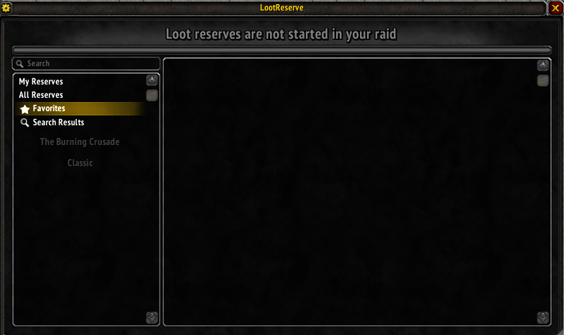
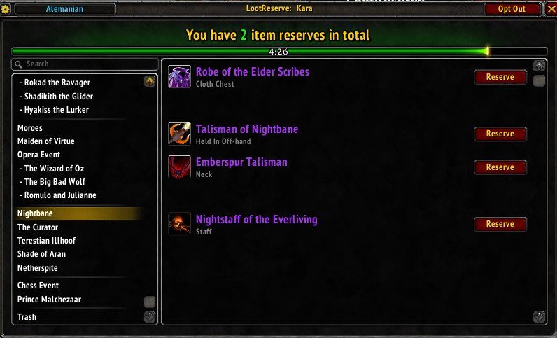
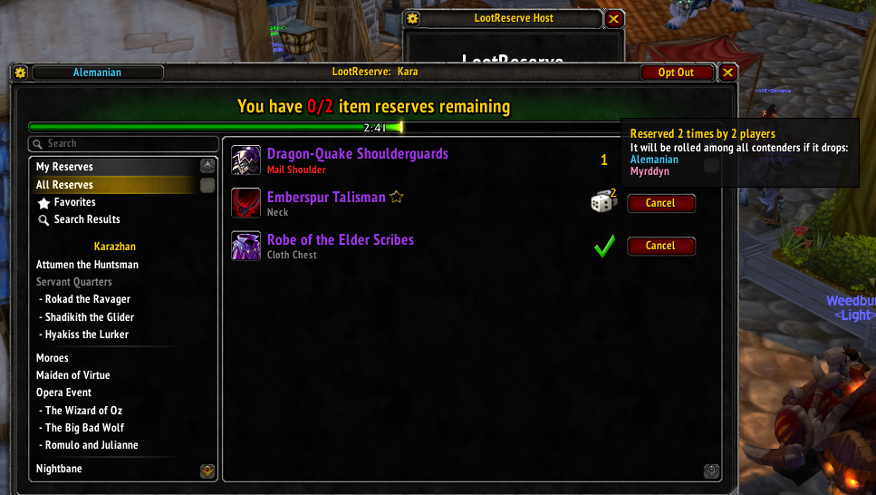
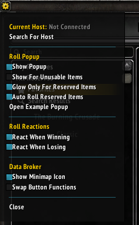

# Design Document

This document will show what changes we plan on making to help me keep track of what needs to be done. It should show current layout along with expected future layout.

- [Windows](#windows)
  - [Main Window](#main-window)
  - [Main Window Options](#main-window-options)
  - [Host Window](#host-window)
  - [Host Window Options](#host-window-options)
- [Backend](#backend)
  - [Tracking of Plusses](#tracking-of-plusses)

## Windows

### Main Window
This window is where members of the raid go to reserve items and to see what items others have reserved.

Things to change:
- Add wrath items (I expect the main maintainer to do this, so will wait for him/her to do so and will update my fork)

This is what it looks like when there is an active raid. Some of the features:
- Shows items appropriate to your class (screenshot was taken from a mage)
- Big ass button to reserve with
- (not shown) Shows indicator if others have reserved the item

Things to change:
- Add a button showing plusses for each item
- Maybe add an indicator whether there are any plusses or not?

This is what it looks like when there is an active raid and there are some reserves. Some of the features:
- Green checkmark showing which item you have reserved if you are the only one to reserve it.
- Number showing how many people have reserved items you _have not reserved_
- Roll icon with a numerical indicator when you have reserved something that someone else also reserved. It shows number who have reserved along with a tooltip showing who has done so.

Things to change:
- Indicator showing plusses

### Main Window Options
These are the options shown to everyone.

Things to change:
- Add a button to see all plusses for the active raid (only when there is a raid set?).
- Add button to show plusses for all people for all raids? If so, what should that look like?

### Host Window

### Host Window Options

## Backend

### Tracking of Plusses
